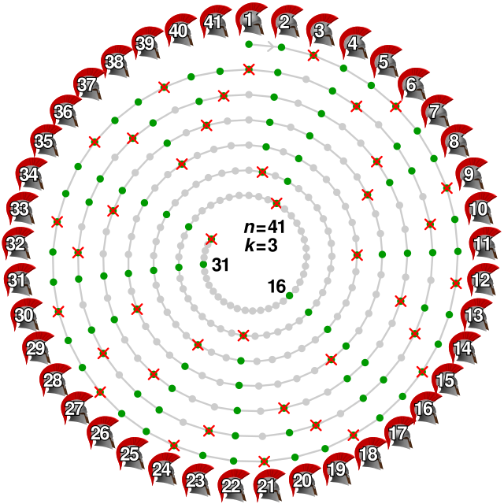

# 💀 Josephus Problem Simulation (Java)

This project is a graphical and algorithmic simulation of the classical **Josephus Problem**, developed in **Java** using the **BlueJ IDE**. It models the elimination sequence and survivor identification for varying group sizes and step values.

---

## 🧠 What is the Josephus Problem?

The Josephus problem is a theoretical puzzle related to a group of people standing in a circle and eliminating every *k-th* person until only one remains. The task is to determine the safe position to avoid elimination.

<p align="center">
  
</p>

Mathematically, it is solved using recurrence:
```
J(n, k) = (J(n - 1, k) + k) % n
```
With base case `J(1, k) = 0`.

This project uses **Java classes** and **GUI-based interaction** to simulate the full process dynamically.

---

## 📁 Project Structure

| File / Class      | Description                                     |
|-------------------|-------------------------------------------------|
| `App.java`        | Main launcher class                             |
| `Aplicacao.java`  | Logic control for Josephus game simulation      |
| `GUI.java`        | Graphical interface using basic Java AWT/Swing  |
| `Individuo.java`  | Class representing each person in the circle    |
| `Regras.java`     | Handles simulation rules and elimination logic  |
| `package.bluej`   | BlueJ project file                              |

> All compiled `.class` and `.ctxt` files are included, but the focus is on source code.

---

## 🖥 How to Run

### 🟦 Option 1: Using BlueJ (recommended)

1. Open the folder in **BlueJ**  
2. Click on `App` class → `void main(String[] args)` → "Run"  
3. Use the GUI to set **number of people**, **step**, and simulate

### 💻 Option 2: Compile manually via terminal

```bash
javac *.java
java App
```

> Make sure Java 17+ is installed.

---

## 🧩 Features

- Visual interface to control inputs and view the simulation
- Dynamic rendering of each elimination round
- Object-oriented modeling (people, logic, rules, UI separated)
- Support for different step values and group sizes

---

## 📸 Example Diagram

The example below illustrates the Josephus logic with 7 people and step size = 3:

```
Initial:   1 2 3 4 5 6 7
Step 3 →   eliminate 3
           eliminate 6
           eliminate 2
           eliminate 7
           eliminate 5
           eliminate 1
Survivor:  4
```

---

## 👨‍💻 Author

Developed by [Leonardo Grupioni](https://github.com/leonardogrupioni)  

---

## 📄 License

Educational project — for academic and personal learning purposes.
